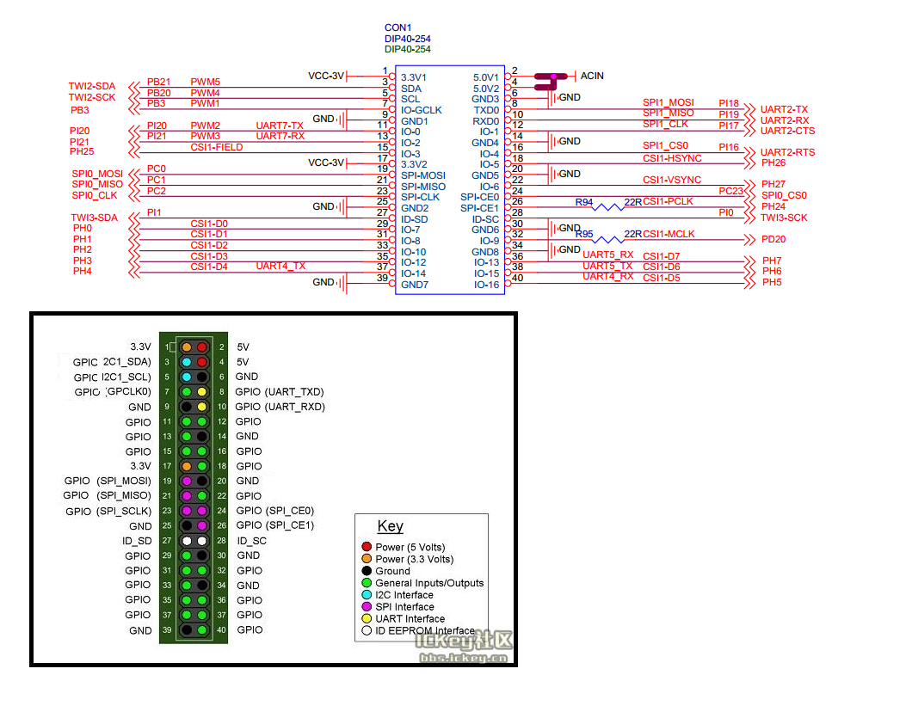

#### Enable peripheries by:
```bash
sudo raspi-config
# 5) Interfacing options
# P8 Remote GPIO -> Enable
```

#### Read pins and their mode and status
```bash
# Get pin layout
gpio readall
```

#### Pin out map


### Light up the LED on pin 11 for 5 seconds than turn off

```bash
pip install RPi.GPIO
```

```python
# test_gpio.py content
import RPi.GPIO as GPIO
import time

PIN = 11  # Physical Pin number

GPIO.setmode(GPIO.BOARD)
GPIO.setup(PIN, GPIO.OUT)

GPIO.output(PIN, GPIO.HIGH)
time.sleep(5)
GPIO.output(PIN, GPIO.LOW)

GPIO.cleanup()
```

```bash
sudo python3 test_gpio.py
```
